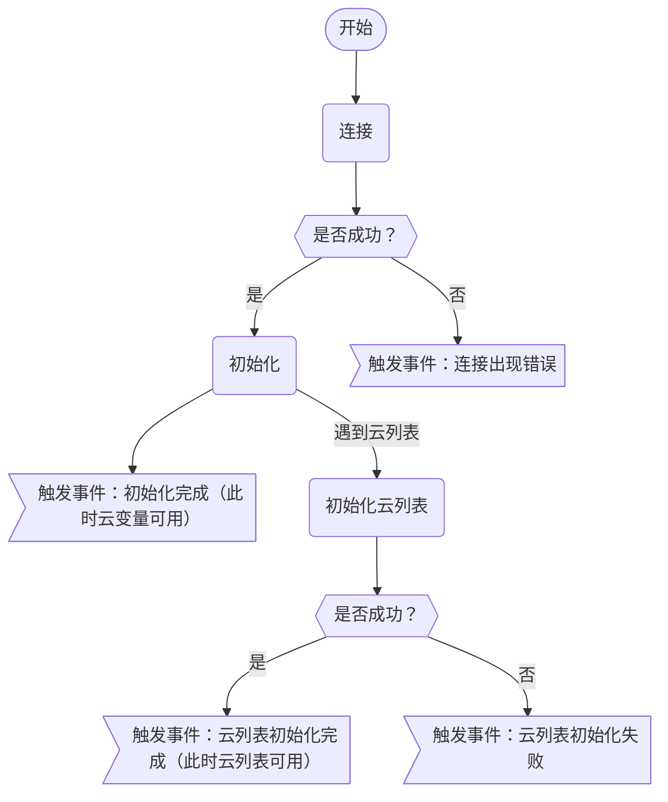

# 源码云功能

## 一、介绍

### 1.简介

源码云功能是针对编程猫源码云功能（云变量、云列表等）的客户端 Coco 控件。

### 2.主要功能

- 获取、修改作品云变量；
- 获取在线人数；
- 获取当前登录的用户信息；
- 获取、修改作品云列表。

### 3.其他

- 该控件的实现细节尽可能地与源码编辑器保持一致；
- 受源码云功能的整体一致性和细节多样性和开发时间的影响，当前版本代码质量非常差。

## 二、使用方法

### 1.下载代码文件

点击<a href="https://gitee.com/slightning/Coco-Widget-Kitten-Cloud-Function/raw/main/%E4%B8%BB%E4%BD%93.js" download="源码云功能.js">这里</a>下载代码文件

### 2.导入到 Coco

在 Coco 上方文件操作菜单中，点击`导入自定义控件`，导入控件即可。

### 3.检测用户登陆状态

所有操作必须在登录编程猫账号的状态下进行。
如果用户未登录，获取到的用户编号为 0，昵称为`未登录用户`，可以以此检测用户是否登录。

### 4.连接到云

在进行除获取当前登录的用户信息之外的任何操作都需要在连接到云后进行。

使用`连接 到 (0)`积木进行连接，其中`(0)`为要连接的作品的 ID。
下图展示了该积木的运行方式。

注意：
- 连接过程是异步执行的。
- 连接云时需要处在未连接状态，如果存在连接，上一个连接会自动断开。
- 由于云列表的特殊性，需要额外的初始化。

### 5.自动重连

当连接异常断开时，如果允许，会自动重连，否则会触发事件：连接出现异常。

### 6.云数据操作

云数据操作与源码编辑器相似，此处不再说明。数字会自动转换。
